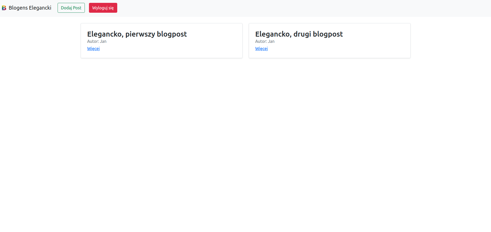

# Blogens elegancki 🅱️

Prosty szkielet blog'a napisany w framework'u Django wykonany przez grupę 3




Aplikacja została napisana w 
- Python 3.9.5
- Django 3.2.4

## ❗ Konfiguracja Postresql 

Aby aplikacja działała poprawnie należy zalogować się w konsoli na użytkownika "postgres" poniższym poleceniem:

```bash
sudo -U postgres
```
Następnie wykonać kolejno kolecenia w celu stworzenia użytwonika z odpowiednimi przywilejami do bazy danych jak i samą bazą danych:

```bash
CREATE USER administrator;
```

```bash
CREATE DATABASE blog_db;
```

```bash
ALTER USER administrator WITH PASSWORD 'qwertyuiop';
```

```bash
GRANT ALL PRIVILAGES ON DATABASE blog_db to administrator;
```

```bash
ALTER DATABASE blog_db owner to administrator;
```

Po wpisaniu powyższych komend, przechodzimy do nowego okna terminala i wykonujemy polecenie:

```bash
psql -U postgres DATABASE_NAME < backup.sql
```
dzięki temu poleceniu prześlemy przykładowe dane do naszej bazy danych

## Instalacja i uruchamianie

Po sklonowaniu aplikacji z repozytorium należy uruchomić środowisko wirtualne:

### Linux & OS X

```bash
source venv/bin/activate
```
### Windows

Środowisko automatycznie jest już uruchomione po sklonowaniu projektu

#

Nastepnie użyj menadżera pakietów [pip](https://pip.pypa.io/en/stable/) do zainatalowania zależności aplikacji. 

```bash
pip install -r requirements.txt
``` 

Kiedy mamy uruchomione środowisko uruchamiamy aplikacje poleceniem:

```bash
python manage.py runserver
```
W przeglądarce wpisujemy 

```bash
http://127.0.0.1:8000/
```

Po wprowadzeniu powinna ukazać się blog


## Użycie

Aby móc korzytać trzeba się zalogować na konto uzytkownika

* Nazwa użytkownika: Jan
* Hasło: ptakilatająkluczem

